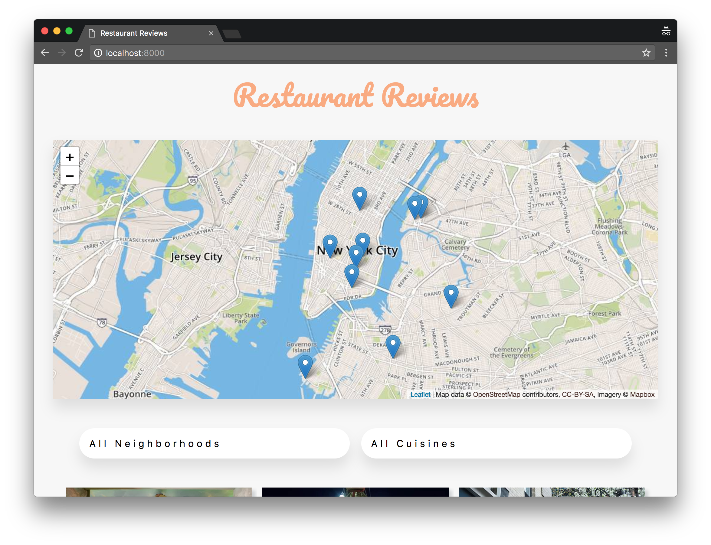
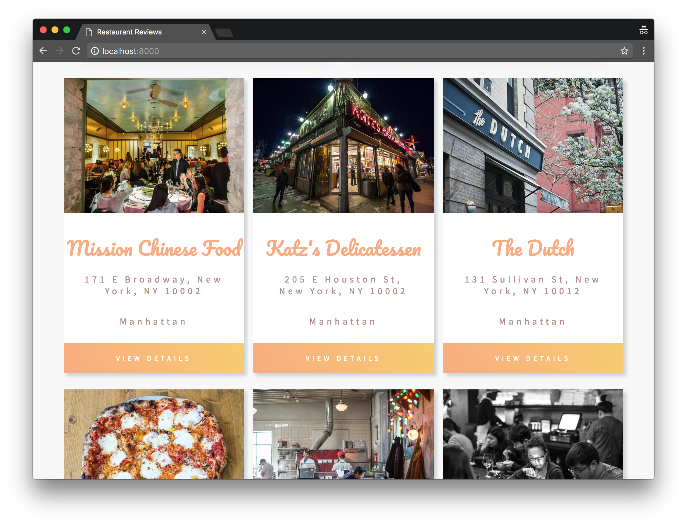

# Mobile Web Specialist Certification Course
---

## Project Overview: Stage 1
This repository is Stage 2 of a 3 part project that is part of the Udacity Mobile Web Specialist Nanodegree Program. This site was redesigned without the help of a CSS framework. 

This series of projects incrementally convert a static webpage to a mobile-ready web application. During **Stage Two**, the  accessible and responsive website created in [Stage One](https://github.com/avaldemoro/MWS_RestaurantReviews_Stage1) will be connected to an external server. The JSON data from the server will also be requested by using asynchronous JavaScript. The data from the server will be stored in an offline database using IndexDB, and the site is optimized to meet performance benchmarks tested by using [Lighthouse](https://developers.google.com/web/tools/lighthouse/). 

### Instructions to Run

1. Download the server repository [here](https://github.com/udacity/mws-restaurant-stage-2), and follow the directions to get it running. 

2. Download this repository and open the root folder in a terminal of your computer.

3. Make sure Python is installed. If not, navigate to Python's [website](https://www.python.org/) to download and install. In a terminal, check the version of Python you have: `python -V`. 
    - If Python 2.x, spin up server with `python -m SimpleHTTPServer 8000`
    - If Python 3.x, spin up server with `python3 -m SimpleHTTPServer 8000`
    - If port 8000 is already in use, use another port. 
    
4. With the server running, visit `http://localhost:8000`.

### Leaflet.js and Mapbox
This repository uses leafletjs with Mapbox. You need to replace `<your MAPBOX API KEY HERE>` with a token from [Mapbox](https://www.mapbox.com/). Mapbox is free to use, and does not require any payment information.  Mapbox is free to use, and does not require any payment information.
