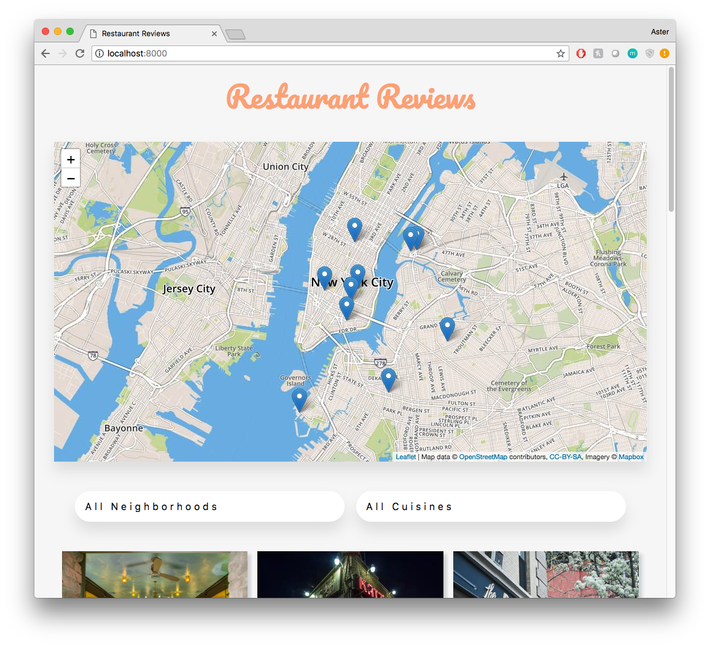
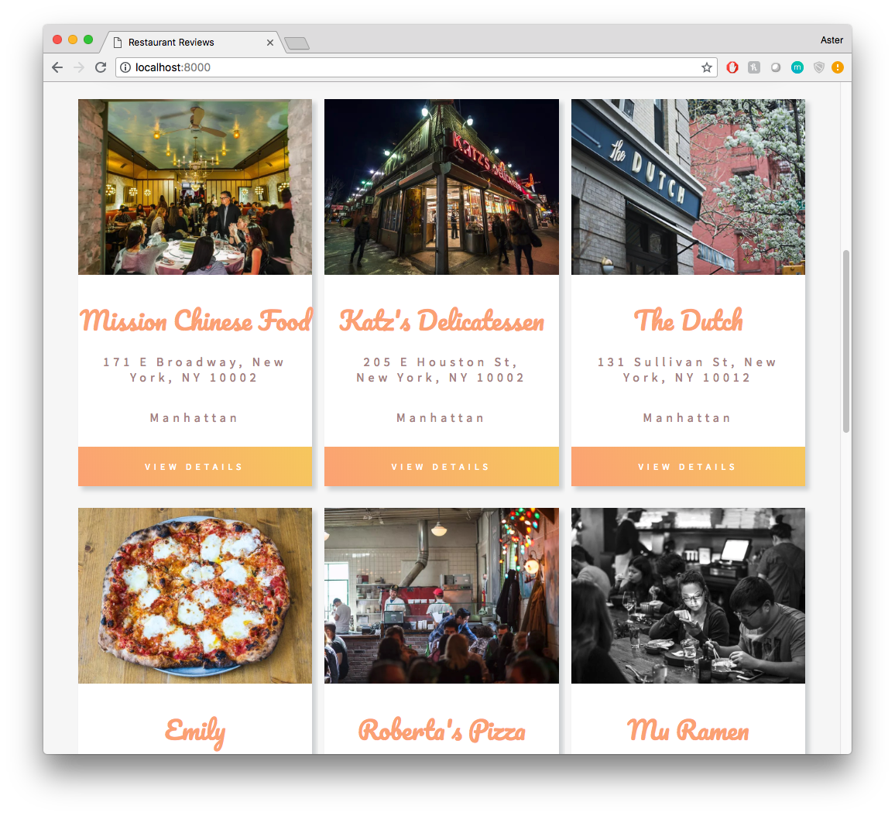
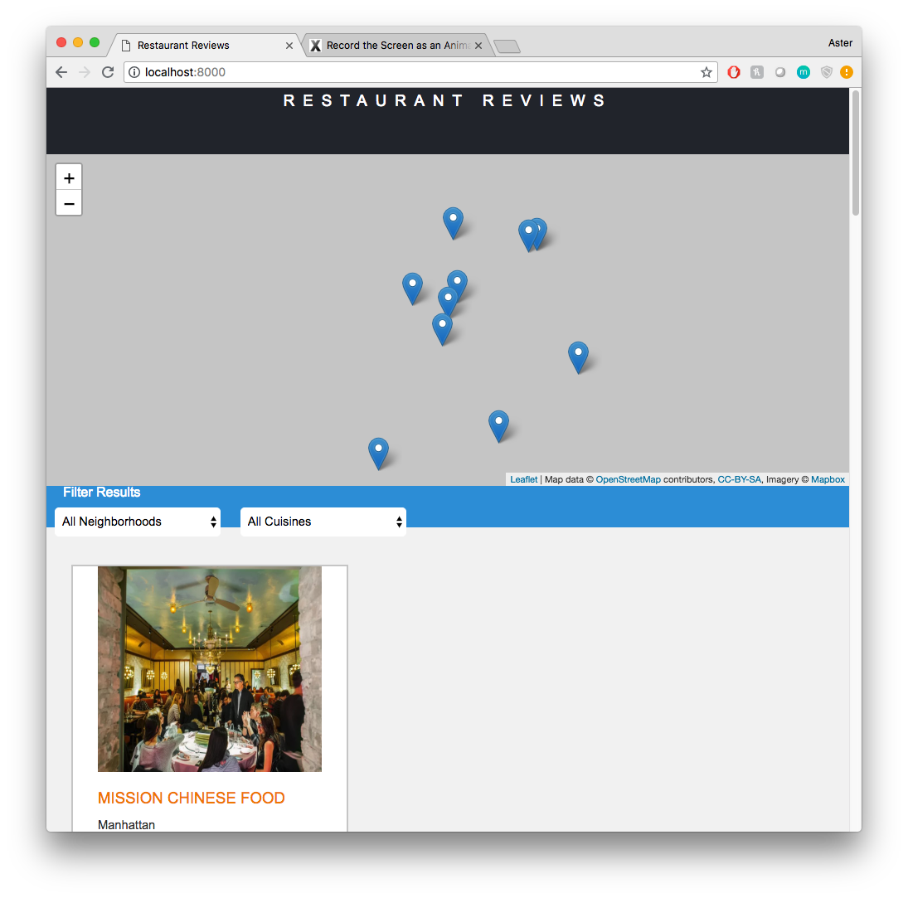
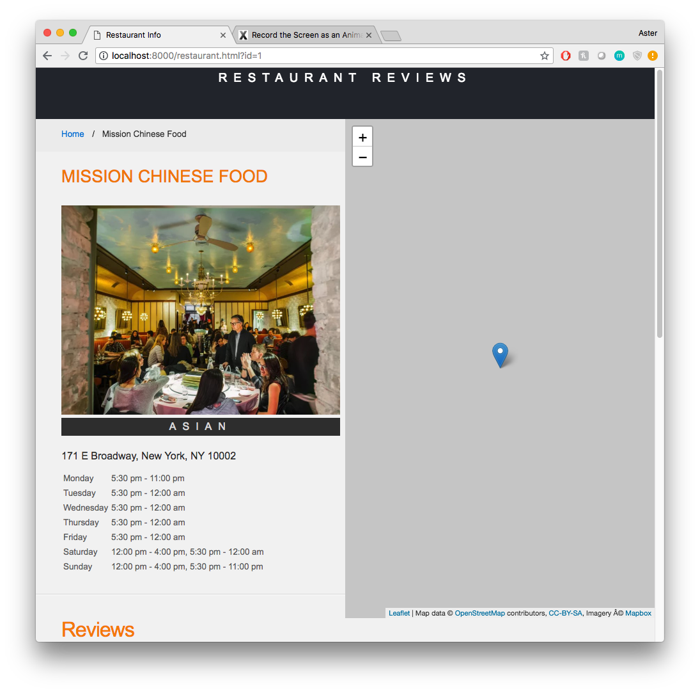

# Mobile Web Specialist Certification Course
---
#### Redesign - Restaurant Reviews Project

## Project Overview: Stage 1
This particular repository is Stage 1 of a 3 part project that is part of the Udacity Mobile Web Specialist Nanodegree Program. The starter code for this repository could be found [here](https://github.com/udacity/mws-restaurant-stage-1). This site was redesigned without the help of a CSS framework. 

This series of projects incrementally convert a static webpage to a mobile-ready web application. During **Stage One**, a website that has a static design and lacks accessibility is transformed into a responsive and accessible for screen reader use site. A service worker is also added to begin the process of creating a seamless offline experience. 

### Instructions to Run

1. Download this repository and open the root folder in a terminal of your computer.

2. Make sure Python is installed. If not, navigate to Python's [website](https://www.python.org/) to download and install. In a terminal, check the version of Python you have: `python -V`. 
    - If Python 2.x, spin up server with `python -m SimpleHTTPServer 8000`
    - If Python 3.x, spin up server with `python3 -m SimpleHTTPServer 8000`
    - If port 8000 is already in use, use another port. 
    
3. With the server running, visit `http://localhost:8000`.

### Leaflet.js and Mapbox
This repository uses leafletjs with Mapbox. You need to replace `<your MAPBOX API KEY HERE>` with a token from [Mapbox](https://www.mapbox.com/). Mapbox is free to use, and does not require any payment information.  Mapbox is free to use, and does not require any payment information.
    
### Initial Website Before Redesign

